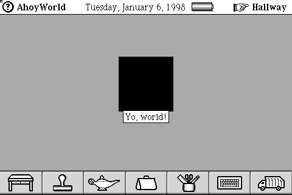
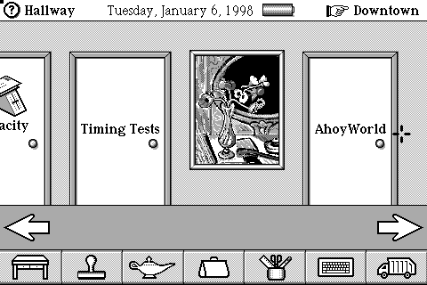
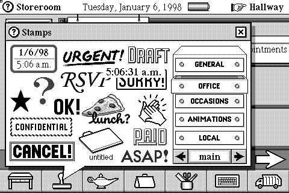

# Rosemary SDK ROM guest testing

This records how packages built by Hatter's [MIPS toolchain](../toolchains/mips/README.md)
were validated in a guest: the SDK's own ROM running in the MagicHat emulator,
with packages delivered through the ordinary PC Link path. The build side is
described in the [build trace](ROSEMARY_BUILD_TRACE.md). The ROM, the emulator
and PC Link are test targets only; none of them is a build dependency.

Commands below assume `mhat` from the MagicHat emulator is on `PATH` and that
`RUN` names a scratch directory for screenshots, logs and saved states.
`scripts/pclink` and `scripts/install-package` are MagicHat scripts. Package
hashes identify the packages built at the time; later builder changes alter
them.

## Booting the SDK ROM

The SDK's Apollo MIPS ROM boots in the emulator's DataRover 840 machine. A
fresh run reaches the startup screen, accepts touch input, completes three-point calibration, and reaches the Desk. The welcome
panel identifies it as **Rosemary (release), 0407198 06:00 AM**.

Tested image: `ROMs/MIPS/Rosemary SDK/MagicCap-USA.image` in the Magic Cap
preservation archive.

- Size: 4,885,207 bytes.
- SHA-256: `fee43c259942baa0fe893be583e41800935a2e06a5dbdeb7ab83739a88aa00f8`.
- RAM: 4 MiB.
- Normal reset and boot, no ROM patches. No existing user save state was loaded.
- Headless with healthy battery input.

The paired `MagicCap-USA` ELF supplies symbols matching this SDK image. Current
DataRover ROM addresses/selectors differ; use the SDK symbols only with the SDK
ROM. This is an additional test target, not a replacement for the production ROM.

## Reproduce from reset

```sh
SDK_ROM='/path/to/Magic Cap/ROMs/MIPS/Rosemary SDK/MagicCap-USA.image'
mkdir -p "$RUN"
mhat --rom "$SDK_ROM" --headless --no-host-battery \
  -n 350000000 --tap-px 240 160 220000000 --tap-hold 3000000 \
  --dump-fb "$RUN/sdk-touch.pgm" \
  --save-state "$RUN/sdk-calibration.state"
mhat --rom "$SDK_ROM" --headless --no-host-battery \
  --load-state "$RUN/sdk-calibration.state" \
  --taps '120,120,20000000;800,740,140000000;460,430,260000000' \
  --tap-hold 45000000 -n 450000000 \
  --dump-fb "$RUN/sdk-desk.pgm" \
  --save-state "$RUN/sdk-desk.state"
```

A separate 200-million-slot fresh run already showed “Touch the screen to begin.”
These are emulator execution bounds, not measurements of physical startup time.
The calibration run uses an isolated state produced from this same SDK ROM.

## Open the tested Desk interactively

```sh
mhat --rom "$SDK_ROM" --load-state "$RUN/sdk-clean-desk.state" --no-host-battery
```

`sdk-clean-desk.state` is a Desk state saved with the welcome panel dismissed.
Scripted taps also opened the File cabinet and returned to the Desk. Saved
states embed ROM bytes, so always use SDK-specific states rather than a
production-ROM Desk state.

## Host-built EmptyPackage installation verified

The first complete code-free sample built on Linux installed and opened in the
unmodified Rosemary SDK ROM. `python3 toolchains/mips/build_empty_package.py`
produces the 1,468-byte `EmptyPackage.pkg` candidate.
SHA-256: `910a14f4d80647d9c764dacb9a7cea62c247ad2bc413d75ffb3838688459ddf3`.
(`build_sample.py EmptyPackage` now builds the same sample from its source
directory.)

The test used the previously calibrated SDK-ROM state, healthy battery input,
and normal guest UI/serial operations. No ROM, RAM, or snapshot patch installed
the package. From the clean desk, Hallway -> right arrow -> Storeroom reaches
the computer. `install-room.state` saves that isolated pre-install state.

```sh
mhat --rom "$SDK_ROM" \
  --load-state "$RUN/install-room.state" \
  --headless --no-host-battery --serial a -n 1500000000 \
  --tap-px 46 162 50000000 --tap-hold 1500000 \
  --dump-fb "$RUN/install-transfer.pgm" \
  --save-state "$RUN/install-transfer.state"
```

While the emulator runs, use its printed PTY (the number varies):

```sh
scripts/pclink /dev/pts/NUMBER --send EmptyPackage.pkg --hangup
```

Observed:

- EmptyPackage appears in the Storeroom, with no error popup.
- Opening the package shows its General Magic author and package details
  (guest-reported size 1,328 bytes).
- Go to locates an EmptyPackage door in the Hallway.
- Opening that door enters the generated Scene.
- Tapping the top-left question mark displays the sample's
  “About EmptyPackage” heading and “EmptyPackage is ... empty” help text.

The selected trial page range 0..0 and integration words 0/1 work for this
candidate. They are not established allocation rules for arbitrary packages.
This validates imported classes/indexicals, fixed fields, names, lists, Text,
cluster metadata and the code-free envelope together in the guest. It does not
validate native MIPS code linking, long-term persistence, or uninstall behavior.

## Native leaf candidate: received, activation rejected

`python3 toolchains/mips/build_native_leaf.py` followed by
`python3 toolchains/mips/build_native_package.py` produces a 1,754-byte
NativeLeafProbe.pkg. Tested SHA-256:
`f66e62b34c30c4e618901e61f0a07d1eaef512340b804cd15ed271fb8a154d94`.
The internal name is NativeLeafProbe; display names still say EmptyPackage.

The candidate adds a CodePackageCluster, local Scene subclass (selector 16 at
locator 148), and native CanGoTo method (function ID 1, code offset 0). It uses
four zero-initialized global bytes, an explicit trial second initialization
header word of zero, and a function-offset table containing one entry.

PC Link receives/stores it, but activation displays that the package cannot be
opened because it is damaged or invalid. **Native execution is not verified.**
This does not invalidate the separate working code-free package.

Corrected diagnostic command uses explicit `0x` prefixes for watch addresses:
`--watch-pc 0x13c7cabc,0x13ccd750,0x13ce671c,0x13ce67b0,0x13ccff44 --watch-log 100`.
An earlier trace without prefixes parsed addresses as decimal 13 and provided
no useful watch evidence. The corrected trace shows:

- Code and initialization attributes reach their readers.
- CodeHandler_InterpretDataInitializationScript is entered twice.
- CodePackageCluster_StartInitializingClasses is entered for the candidate.
- Exceptions_Fail is called with return address **0x13e43084**, inside
  FixUpCodeAddress, then again from the activation cleanup path at 0x13cd2a68.

FixUpCodeAddress at 0x13e4300c checks the incoming method-code value against the
function-offset table count, then permits already-translated values above the
code base. The failure branch reaches 0x13e43078..0x13e43080. Next diagnostic:
identify the particular method-code slot/value reaching this check and whether
class traversal, function metadata, or earlier renumbering produced it. Do not
patch the ROM or guess a bypass for this validation.

## Native leaf dispatch verified

The activation failure above is fixed. The function-offset table must reserve
IDs **1 and 2** for constructor/destructor lists even when both are null; their
offsets are FFFFFFFF. The first actual method uses ID **3** with code offset 0.
The failing trace had table count 1 but incoming values 1, 1, then **2** in s0;
that final value failed FixUpCodeAddress's bounds check. With three entries,
the guest resolves the real method and both reserved entries successfully.

The first corrected Scene override activated, but the hallway-door path did
not call Scene.CanGoTo. The final probe instead subclasses
**SoftwarePackageContents**, overriding CanGoTo on the contents object used by
the normal package UI. The generated Scene remains an ordinary Scene.

Tested package SHA-256:
`63631a6730e745e012e4cde7fb83dbd301a078f9cbb613753c48dd9017bdbf87`
(1,762 bytes).

After installation from `install-room.state`, scan the RAM portion of the saved
snapshot read-only to locate the extracted eight code bytes. This run had one
match at **0x003CCBE4**. No snapshot or guest memory was patched. Opening the
package and selecting Go to used this command:

```sh
mhat --rom "$SDK_ROM" \
  --load-state "$RUN/contents.state" \
  --headless --no-host-battery -n 110000000 \
  --taps-px '279,213,1000000;450,150,50000000' --tap-hold 1500000 \
  --watch-pc 0x003ccbe4 --watch-log 20 \
  --save-state "$RUN/dispatched.state" \
  --dump-fb "$RUN/dispatched.pgm"
```

The watch log records **three entry hits** at 003CCBE4, receiver a0=00046304,
dispatch selector t7=000010E0 (CanGoTo), return address ra=13E2C7AC. The guest
reaches the Hallway with the package's door. This confirms dispatch into the
host-compiled method, beyond receiving or activating a package. The method is
`jr ra; addiu v0,zero,1` and has no calls/globals/relocations.

All **158 host tests passed**, including explicit null slots 1/2 and method
ID 3. General relocation handling and calls from native package code into ROM
methods/intrinsics are still untested. Those are the next milestone.

## Native-to-ROM call verified

A hand-written assembly probe built NativeRomCall.pkg
(1,834 bytes, SHA-256
`ed6d7d6aefc34728396eb8cecc9498191a5f2c675a6f9f337ff15150f5aaa72b`). It is the
NativeLeafProbe package with two changes: the `CanGoTo` override calls the ROM
operation `Name(self)` through the object-method dispatcher before returning
true, and its four bytes of globals are initialized by a `Dispatchers` index-1
resolution entry instead of zeros. The build-side convention is recorded in
the [build trace](ROSEMARY_BUILD_TRACE.md#native-to-rom-calls-the-convention-from-package-code-and-the-guest).

Installed from `install-room.state` exactly as the leaf (PC Link send during
a 400M-instruction run; `contents.state`), then opened and sent through Go to
from that state:

```sh
mhat --rom "$SDK_ROM" \
  --load-state "$RUN/contents.state" \
  --headless --no-host-battery -n 110000000 \
  --taps-px '279,213,1000000;450,150,50000000' --tap-hold 1500000 \
  --watch-pc 0x003ccbb4,0x003ccbd8,0x13cedbe0 --watch-log 40 \
  --save-state "$RUN/dispatched.state" \
  --dump-fb "$RUN/dispatched.pgm"
```

The probe code was located read-only in the snapshot at RAM `0x003CCBB4`;
`0x003CCBD8` is the instruction after its `jalr`; `0x13CEDBE0` is
`Object_Name` in the SDK ROM (symbol from the paired ELF). The watch log
shows, twice (once per open):

- `003CCBB4 … a0=00046304 t7=000010E0 gp=003CCBA0` — entry from the ROM
  dispatcher with `$gp` at the package globals.
- `13CEDBE0 ra=003CCBD8 a0=00046304 t7=0000105B gp=003CCBA0` — the ROM method
  entered from the probe with the probe's receiver and selector 4187.
- `003CCBD8 … v0=000416E4 gp=0000E020` — return to the probe with a Reference
  result and the ROM's `$gp`, which the probe then restores.

The guest raised no faults (bus: 0 faults) and reached the Hallway with the
package's door; 160 host tests passed.
Not covered: arguments beyond the receiver, intrinsic calls (dispatcher index
0, or the code/GP pair form used for imported function pointers), package
globals beyond one word, relocations, and package-defined selectors.

## Arguments and an intrinsic (NativeRomCall2)

A second assembly probe, NativeRomCall2 (globals initialized from
`Dispatchers` indexes 0 and 1), is a 1,915-byte package (SHA-256
`dc91722107c58f357ba68b1abf765638e8cf99bebfc9460f83057bf6aabbb76c`) whose
`CanGoTo` performs three ROM calls: `name = Name(self)`, `SetName(self, name)`
(selector 4188, argument in `a1`) and the intrinsic `Honk()` (selector 77,
the literal in PublicInterface.cdef, through the intrinsic dispatcher in
globals word 0). Same install and open recipe as above; watchpoints on the
probe entry (RAM `0x003CCB74`), `Object_Name`, `Object_SetName` (0x13CEE1CC)
and `Sound_Honk` (0x13C3D620). The watch log, per open:

- `13CEDBE0 ra=003CCB9C a0=00046304 t7=0000105B` — Name from the probe.
- `13CEE1CC ra=003CCBBC a0=00046304 a1=000416E4 t7=0000105C` — SetName with
  `a1` equal to the Reference Name had just returned: **argument passing works**.
- `13C3D620 ra=003CCBD0 t7=00000268 gp=0000E020` — Sound_Honk entered from the
  probe's intrinsic-dispatcher call; the ROM has already switched `$gp` and
  `t7` by then, so the intrinsic dispatcher, like the object one, takes the
  package's selector in `t7` and resolves it itself.

Three opens, 0 bus faults, Hallway reached. Still untested: stack arguments
(beyond `a3`), the code/GP pair form for imported function pointers, package
globals used by code, and package-defined selectors.

## C-compiled method verified (NativeCProbe)

`python3 toolchains/mips/build_c_package.py toolchains/mips/c_probe.c`
compiles the probe with Clang 18, links it with lld and freezes it (see the
[build trace](ROSEMARY_BUILD_TRACE.md), "Compiling C on the host"). The C method
calls `Name`, `SetName` and `Honk` through generated stubs, calls a static
helper, and accumulates a `static unsigned counter` in package globals.
Package: 2,271 bytes.

Same install/open recipe; entry found at RAM `0x003CCB14`, `$gp` on entry
`0x003CCAB8`. The watch log shows Object_Name,
Object_SetName (with the Name result in `a1`) and Sound_Honk entered from the
C code on each of three opens, 0 bus faults. Reading the saved state at the
globals base afterwards:

- `counter` (globals + 0x40) = `0x565C74`, exactly the value computed from the
  three observed `Name` results through `helper()` — **globals reads/writes
  and the static call work**.
- GOT page entry (globals + 8) = `0x003CCAB8`, the globals base; stub entries
  = `0x003CCBC8/DC/B4` inside the code buffer; the `__dispatchers` words =
  `0x13EB8050/48/38/40`, the ROM's dispatcher entry points — the
  initialization script's code-/globals-relative words and `Dispatchers`
  resolutions did the relocation.

Not yet covered: multiple methods/classes, C++ or the SDK's `Magic.h`
headers, class operations, imported package interfaces, locators/indexicals,
Text/other constant objects, and packages with more than one function-table
entry.

## HelloWorld built on Linux draws in the guest

`python3 toolchains/mips/build_hello_package.py` ports the SDK's
HelloWorld sample: `toolchains/mips/hello.c` is `Greeter_Draw` from
`Samples/HelloWorld/HelloWorld.cpp` (PartColor, Highlighted, ContentBox,
CurrentCanvas, CurrentClip, FillBox) compiled through the C pipeline; the
builder adds a package-defined `Greeter` class (Viewable subclass, native
Draw override) and a Greeter instance from Objects.odef (origin <0,-14>,
size <90,90>, viewFlags 0x7818D200, iBook12, white/black) inside the
package's Scene. Package: 2295 bytes, SHA-256 `b019d013449b2a692a1f4d38d8e7578bd1a64dc2bd27f5d5a0945ecad1f6125f`.

Install as before, then open the package, Go to, and tap its door in the
Hallway (`--taps-px '279,213,1000000;450,150,50000000;380,150,100000000'`,
180M instructions). The watch log:
`003CCA94 #1 ra=13D5D994 a0=00046394 t7=00000F8B gp=003CCA38` — the ROM's
drawing code dispatched Draw (selector 3979) to the C method — and
the screenshot shows the scene with the **90x90 black box** the method
fills. 0 bus faults.

Frozen-format facts this needed, all corpus-checked: heap selectors are
4 + 8 x heap index (cluster root at 4); a Viewable's subviews are the
ObjectList in its extra data (Penguin's scene lists five objects whose
`superview` field is the scene); a plain viewable's header is
`0xB0000000 | class`; the new class's superclass is an imported class
selector, and the method record's operation is an imported package
selector. The Greeter is unnamed (no "Yo, world!" label) because the name
dictionary was not extended, and silent because iSendSound is not imported.

## Unmodified SDK HelloWorld.cpp, compiled with the SDK's own headers

`python3 toolchains/mips/build_hello_package.py --sdk` compiles
`Samples/HelloWorld/HelloWorld.cpp` **as shipped** — `#include "Magic.h"`,
the generated `MagicCap.gnu.xh`, `CURRENTCLASS`, `Method` — through
`build_sdk_package.py`, and freezes it into the same Greeter package.
Package: 2466 bytes, SHA-256 `9b1bd4b592dcea90d4d8886b842de7351ae318f4a40ae0fa9ddab159ed0d0fb8`.

Same install and open sequence. The watch log:
`003CCA24 #1 ra=13D5D994 a0=00046394 t7=00000F8B gp=003CC9A8`, and the
screenshot shows the black box. In the saved state the two intrinsic
transition-vector pairs the loader filled hold `13D05440/0000E020` and
`13D054C8/0000E020` (CurrentCanvas and CurrentClip code with the ROM's GP),
and the `_functionPointer_Wildcard_SystemPublic_425_/427_` words point at
those pairs. 0 bus faults.

A first attempt resolved the intrinsic slots in word mode (kind 6,
destination mode 4) directly into the function-pointer words; the guest
reset during package open, so that mode does not yield a vector address.
The corpus form — an eight-byte pair filled in pair mode, pointed to by the
word — works.

## HelloWorld complete: names and sound

With the pristine name dictionary extended over every locator up to the
greeter (`HelloWorld` for the contents, `AhoyWorld` for the scene,
`Yo, world!` for the greeter; the greeter header carries the named flag
0x01000000) and `iSendSound` imported as a fifth locator for the greeter's
`sound`, the `--sdk` build is the sample as the SDK manual describes it:




Storeroom shows **HelloWorld** (3K), the Hallway an **AhoyWorld** door, the
scene the black box labelled **Yo, world!**. Package 2538 bytes,
SHA-256 `4c3cc7c38bca33b8873ae0d5ae7a3d264f68bfa72ed87abcc704b7b72844a549`;
0 bus faults. The touch sound is not verified headless.

## Inherited calls and package class numbers (hello_inherited.cpp)

`python3 toolchains/mips/build_hello_package.py --sdk --source
toolchains/mips/hello_inherited.cpp` builds HelloWorld with one change
in the sample source: `Highlighted(self)` becomes `InheritedHighlighted(self)`,
the header's `__2d_Highlighted(InheritedObjectMethodDispatcher, operation,
ClassNameToNumber(CURRENTCLASS), self)` form. Package 2625 bytes,
SHA-256 `f4bca5af207031e1cd625da89cfafb3fde51cd695e4732c319ad1919d84f55a3`.

The watch log (started after the door tap):
`003CCA04 #1 … t7=00000F8B gp=003CC978` (Draw dispatched), then
`13C96E70 ra=003CCA54 a0=00046394 t7=00000FFD a2=000006B1` — the ROM's
`DispatchInheritedObjectMethodSetup` entered from the package code with
Highlighted's selector and class number **0x6B1**, the runtime number the
loader stored in `_classNumber_Greeter_` (read from the saved state) for
package class selector 16. The box drew as before; 0 faults.

This required a package export table with one entry, `@Greeter` (class,
count 1, selector 16), which the initialization script's kind-2 resolution
of `@Greeter` reads; the table uses lgCount 0 (one bucket, chain head slot
1) so no hash function is needed.

## DigiClock: a second sample, unmodified, through the generic assembler

`python3 toolchains/mips/build_digiclock.py` compiles
`Samples/DigiClock/DigiClock.cpp` as shipped and assembles the package with
the new generic `build_package.py` from a transcription of its Objects.odef:
a `Digitalis` class (Box + HasDestination + CanInstallSelf; five native
methods InstallSelf, Tap, Draw, Idle, AutoMove; `destination` at fixed
offset 48 after Box's 48 bytes, own-fields word 0x9004 as in the corpus),
one instance, an installation list, the package indexical `iDigitalis`
(exported `@iDigitalis`) and the class export `@Digitalis`. Package
3621 bytes, SHA-256 `732bd2f353d6d29c89fc77cd57eb07340cb8b8fe3eaf5d99ed958124c38ff133`, code 1296 bytes.

- Installation (watch log): `003CB614 #1
  t7=00000BD4` — the guest dispatched **InstallSelf** (selector 3028) during
  activation; it ran `OnScreen(iMagicWindow)`, `Index(iStampDrawers)`,
  `First/At` on the drawer list and `AddUnique(officeDrawer, iDigitalis)`
  (system indexicals through the base-locator word, the package indexical
  through its `@iDigitalis` export) and returned; the Storeroom shows
  DigiClock (4K).
- Opening the Stamps window and the Office drawer: **Draw**
  (t7=0xF8B) and **Idle** (t7=0xFF1) dispatched repeatedly to the package
  code, and the screen shows the digital clock reading `5:06:31 a.m.` inside
  its rounded button border among the stamps:



0 bus faults throughout.
Draw here is `InheritedDraw` (Box) plus `PaintTextInBox(TimeAsTextWithFormat(
LocalTime(), ...))`, so inherited dispatch, intrinsic calls and five-argument
operation calls all run inside one method.

## Samples built from their source directories (front end)

`python3 toolchains/mips/build_sample.py HelloWorld` and
`... DigiClock` read the sample's `.cdef`, `.odef` and `.cpp` as shipped
(`odef_frontend.py` parses the definitions into a `build_package` spec and
generates the package `.xh/.xph`), compile with Clang and freeze. Nothing is
hand-transcribed any more.

- HelloWorld: 2606 bytes, SHA-256 `ced55c519b1d7a6e78b0476f1026451ac0f71f2f257bb5461f082f82dd95a224`; Draw dispatched
  (`003CCA24 t7=0F8B`), AhoyWorld scene with the labelled box.
- DigiClock: 3621 bytes, SHA-256 `1af15c5ced58b5c787ae400f11edbdd219cb071f9380cb8a7d593d2feea84f25`; differs from the
  hand-built package only in the `destination` word format (14, weak — the
  class image says so); installed and ticking in the Office drawer.
  0 faults in both.

## TimeMinder and PackageSceneSample from source

`build_sample.py TimeMinder` (four classes, four methods incl. an Actor's
`Main`, 31 instances, a class-operation call `RunNext(Scheduler_)`,
nil-bound package indexical) installs and adds its `connect` command to
the Clock scene: the Commands window shows "Clock commands: connect". `build_sample.py
PackageSceneSample` installs and its scene opens from the Hallway. Both
0 faults. These are installation/integration checks; their code paths were
not driven further.

## Puzzle, ScrollableTextField and RulesSample

`build_sample.py Puzzle` (21K, images and a game scene) and
`ScrollableTextField` install through PC Link with the run length raised
to 800M–1.2B instructions (larger transfers). `RulesSample` first failed
activation: "damaged or not valid" from `PackageCluster_ActivatePackage`
after `CodeHandler_InitializeCodeGlobals` — the init-script interpreter
rejected the package's own operation-number lookups because the cluster's
`operationBase1`/`operationCount` were 0 (build trace, "Package operation
numbers"). With the fields filled the package installs (17K in the
Storeroom), activates (a "RulesSample" door appears in the Hallway) and
the door opens its scene with the "Stamps" RuleBox
([screenshot](images/rosemary-rulessample.png); 0 `Exceptions_Fail` hits while
opening). The one `Actor_FailSoon` posted during installation comes from
`PCLinkServer_CleanUpListenerActor`, the PC Link hangup, not from the package. The
rule itself (limiting stamps dropped into the box) was not exercised.

Stopping a run with `-n` just before an event and inspecting the saved state
while the objects are still live is how the interchange-table entries above
were read.

## ExportSample + ImportSample: dynamic linking between two packages

Both built from their unmodified directories and installed in that order.
Hallway → the "Client" door →
the Installer button ("Touch me to install objects into the Stamper") →
Stamper → bank arrow twice: a third bank "new" (NEW1..NEW4, ExportSample's
`iPrototypeStampBank`/`iDrawerNames`) whose first drawer holds the Greeter
"From ImportSample" ([screenshot](images/rosemary-importsample.png)). 0
non-interrupt exceptions across the eight steps, 0 faults. The imported
words at method entry read 0x6B1 (ExportSample's class number) and 0x15DE
(InstallIntoDrawer's operation number); the package's own `ToBeInstalled`
was 0x15E0.

Two failures on the way (both fixed in the toolchain, see the build
trace): the guest restarting with "Cleaning up…" because the attribute
getter had no auto accessor record and returned nil, then an address
error in a transition-vector stub because Clang had not re-established
`$gp` after a ROM call.

Save states for later watched runs from unwatched runs: a state saved by a
watched run carries that run's watch list along.

## SpeedScrollSample: package mixins and a tool page

Built from its unmodified directory; installs (22K). Tools window →
page right four times → "trinkets" page shows the scroller tool (eye icon,
[screenshot](images/rosemary-speedscroll-tool.png)); tapping it makes it the
current tool (the toolbar's tool slot shows the eye) and a touch in the
Storeroom creates a 40×40 `SampleSpeedScroller` ([screenshot](images/rosemary-speedscroll.png)),
its `Draw` running from package code. 0 non-interrupt exceptions across
the nine steps; the one `Bp` during activation is the ROM's remote-debugger
notification. The three failed attempts before that (serial-driver
overrun, empty tools page) and their causes are in the build trace,
"Package mixins".
RulesSample (now with its animation drawn) and DigiClock re-verified after
the header/superview changes.

## The four Magic Script samples

All built from their unmodified directories (`magic_script.py`; build trace,
"Magic Script"), installed one at a time (guest runs sharing a ROM cannot
overlap), each opened from its
Hallway door and driven through one scripted button:

- **TicTacToe** (29K): a board square's script places X; the game answers O
  ([screenshot](images/rosemary-tictactoe.png)).
- **Exceptions** (7K): "try" → `TrySample` allocates until memory is gone
  and rethrows; the ROM's "communicator is now completely full" dialog is
  the sample's point ([screenshot](images/rosemary-exceptions.png)).
- **SimpleStack** (11K): "new" → `CreateNewCard`; the stack goes from
  "1 of 2" to "3 of 3" ([screenshot](images/rosemary-simplestack.png)).
- **AccessDemo**: "Toggle Bunny" → the branch-and-variable script hides the
  bunny ([screenshot](images/rosemary-accessdemo.png)).

`ScriptedMethod_InterpretScript` was watched in every case (one entry per
button press); 0 non-interrupt exceptions except Exceptions' deliberate
failure path. These four samples provide direct interpreter coverage for branches, locals,
arithmetic, operation calls, intrinsic calls, object references and the
intentional exception path.

## The rest of the samples: Scenes, Puzzle, ScrollableTextField, WindowTool

- **Scenes** (code-free, 6.8K): its scene opens from the Hallway door
  ([screenshot](images/rosemary-scenes.png)).
- **Puzzle** (21K): installs its icon on the Game room shelf; the icon opens
  the puzzle scene, and scramble → yes shuffles the picture tiles
  ([screenshot](images/rosemary-puzzle.png)).
- **ScrollableTextField**: its scene opens ([screenshot](images/rosemary-scrollabletextfield.png)).
- **WindowTool** (15K): installs into the construction-mode tool pages,
  which the user-mode guest does not display — expected per the sample.

With these, every sample that can be driven in user mode has been opened in
the guest; 0 non-interrupt exceptions throughout.

The remaining validation boundary is not basic package execution: it is
general-purpose application coverage beyond the preserved samples, including
larger native methods, arbitrary signatures, and persistence/uninstall flows.

## Installing a built package

MagicHat's `scripts/install-package` wraps the recipe above. Build in the
Hatter checkout, then install from the MagicHat checkout:

```sh
python3 toolchains/mips/build_sample.py HelloWorld --out "$RUN/HelloWorld"
scripts/install-package "$RUN/HelloWorld/HelloWorld.pkg" "$RUN" install
```

It boots the install-room snapshot, taps the computer, sends the package with
`scripts/pclink` (which completes the two-`Cntd` handshake, so size is not a
limit — WCPack's 126 KB transfers) and hangs up, leaving `install.state` to
open the package from. `INSNS` scales the run for larger packages; `STATE`
starts from another snapshot (e.g. to install a second package); `MHAT`
selects the emulator binary. The emulator's storage card persists installed
packages across runs but is a guest-formatted image, not a host-side
delivery path.
